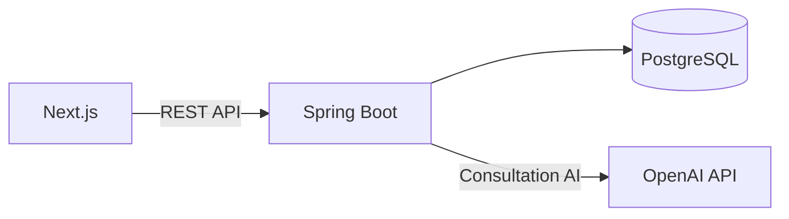

# 고령층 금융 도우미

금융 상담의 진행 상태와 AI 파생 데이터를 저장하고,
긴급 금융 피해 대응 API를 제공하는 Spring Boot 서버입니다.

AI가 생성한 결과를 바로 서비스 상태로 사용하지 않고,
Backend에서 검증한 뒤 저장하고 다음 상담 단계로 이동하도록 구성했습니다.

> 현재 AI V1까지 구현했습니다.  
> 공식 금융자료 Source Ingestion과 RAG, 근거 검증은 다음 단계에서 진행합니다.

## Architecture



일반 상담에서만 OpenAI를 사용합니다.

긴급 금융 피해 대응은 runtime AI를 사용하지 않고
서버에 저장된 `EmergencyScenario`를 조회합니다.

## 상담 처리 흐름

```text
Consultation
→ Case Understanding
→ Follow-up Question
→ Summary
→ 사용자 확인
→ Analysis Job
→ Report
```

사용자가 입력한 원본 데이터와 AI가 생성한 결과를 구분하고,
입력 내용이 변경되면 이전 AI 결과를 그대로 사용하지 않도록 revision을 확인합니다.

## 구현에서 중요하게 본 부분

### Guest Session과 상담 소유권

로그인을 요구하지 않고 상담을 시작할 수 있도록 Guest Session을 사용했습니다.

Cookie에는 임의로 생성한 Guest Token만 전달하고,
DB에는 원본 Token 대신 SHA-256 Hash를 저장합니다.

상담 조회와 수정 시에는 Consultation ID만 확인하지 않고
현재 Guest가 소유한 상담인지 함께 확인합니다.

### AI 결과 검증

```text
OpenAI Structured Output
→ DTO 변환
→ Bean Validation
→ Business Validation
→ 저장
```

AI는 구조화된 결과 후보를 생성하고,
실제 저장과 상담 상태 변경은 Backend에서 처리합니다.

현재 입력 revision과 AI 결과의 revision도 비교해
사용자가 입력을 수정한 뒤 이전 AI 결과가 저장되는 상황을 막았습니다.

### 비동기 분석

AI 분석을 하나의 긴 DB Transaction 안에서 처리하지 않습니다.

```text
Analysis Job 생성 / 상태 저장
→ Commit
→ OpenAI 호출
→ 결과 검증
→ Report 저장
```

Frontend는 Analysis 상태를 조회하며 진행 상황을 확인합니다.

실패한 분석은 retry할 수 있고,
추가 정보가 필요한 경우에는 기존 상담 흐름으로 다시 연결합니다.

### 긴급 금융 피해 대응

긴급대응 내용은 AI가 자유롭게 생성하지 않습니다.

피해 유형별 `EmergencyScenario`를 서버에서 관리하고,
사용자가 선택한 유형에 맞는 즉시 행동, 금지 행동,
연락처와 증거 보존 방법을 반환합니다.

## Security

- Guest Token 원문 DB 저장 금지
- Production Cookie: `HttpOnly`, `Secure`, `SameSite`
- CSRF 검증
- 허용된 Frontend Origin 기준 CORS
- Consultation 조회 시 Guest Ownership 확인
- 상담 원문과 민감정보 Log 기록 제한
- 정의하지 않은 Endpoint는 기본 차단

## Test

상담, Guest Session, Follow-up, Summary,
Analysis, Report, Emergency 흐름을 Integration Test로 확인했습니다.

## Tech Stack

`Java 21` `Spring Boot` `Spring Web MVC`  
`Spring Data JPA` `Spring Security` `PostgreSQL`  
`Flyway` `OpenAI Java SDK`

## Run

```text
DB_URL
DB_USERNAME
DB_PASSWORD
OPENAI_API_KEY
AI_ENABLED=true
```

```bash
./gradlew bootRun
```

## Links

- [Frontend Repository](https://github.com/Economy0326/financial-helper-frontend)
- [Project Documentation](https://cute-quit-4fd.notion.site/3bd25931ce3580ae8ad8f0fa3acdf41a)

## Next

다음 단계에서는 Backend에서 공식 금융자료를 수집하고,
검색 결과를 AI 분석의 근거로 사용할 수 있도록 RAG를 추가할 예정입니다.
